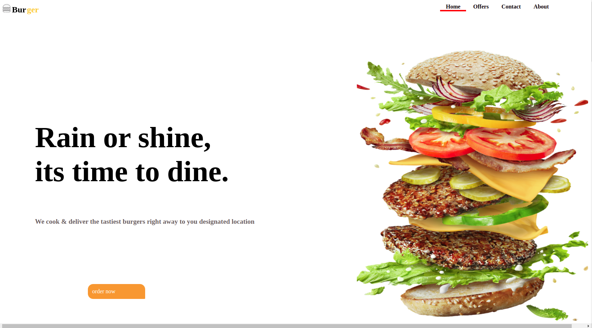

<h1>WebApp</h1>

 A webapp using HTML and CSS to show the layout of a restraurant products. It helps display the items content in a an orderly manner and it has an ordering section which allows users to make orders which the seller will deliver

<h1>Demo</h1>

Here is a a liveof what the website looks like

<h1>Site</h1>
<h2>landing page 

 currently it displays the burgers food items

<h1> Usage </h1>
<h2> landing page<h2>

If you want to make changes,debug or enhance the existing module,follow the following steps

    <ul>
          <li>Fork the repo.</li>
          <li>Create a new branch (git checkout -b improve-feature)</li>
          <li>Make the appropriate changes in the files</li>
          <li>Add changes to reflect the changes made</li>
          <li>Commit your changes (git commit -am 'Improve feature')</li>
          <li>Commit your changes (git commit -am 'Improve feature')</li>
          <li>Create a Pull Request</li>
    </ul>

<h1>Bug /Feature support</h1>

for a bug found feel free to dm me

if you would like to request a new function feel free to do so

<h1>Built with</h1>
<ul>
    <li>HTML</li>
    <li>CSS</li>
</ul>

<h1>To-do</h1>

increase the responsiveness of the webpage and make changes where applicable

<h1>License</h1>
MIT @boniface